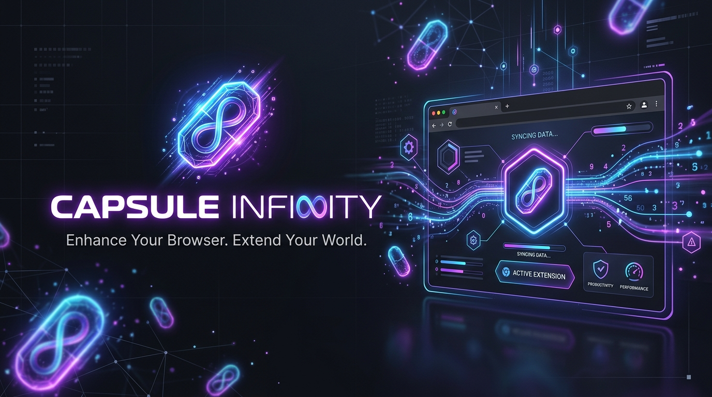
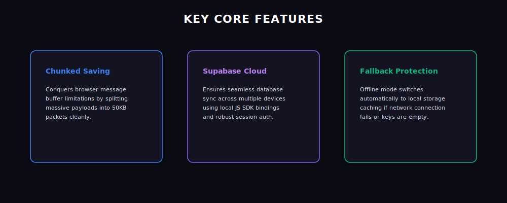
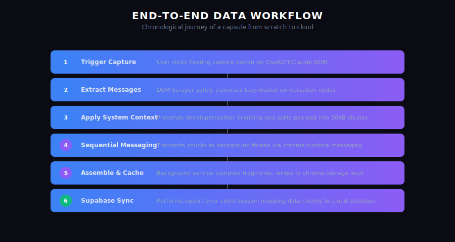
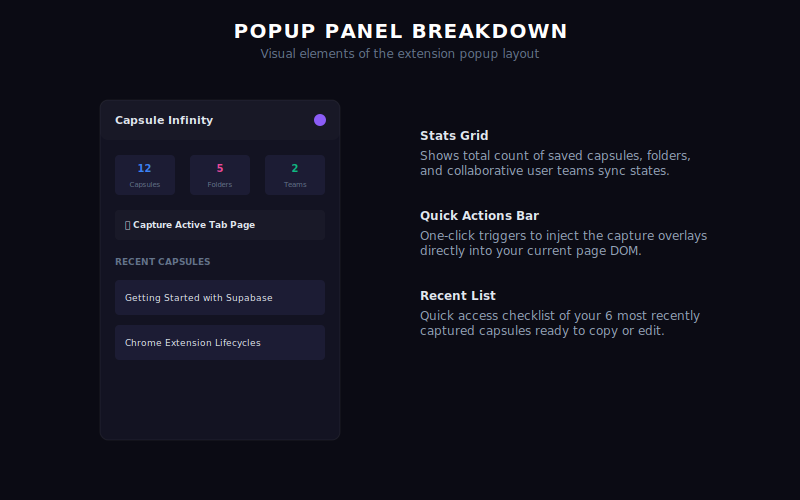
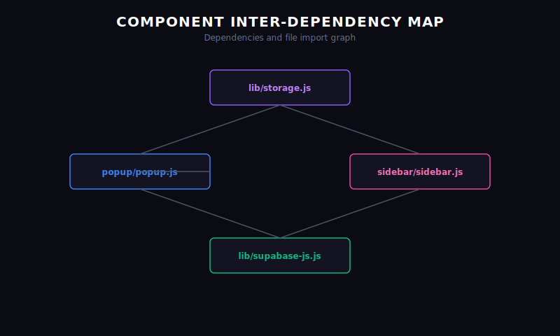
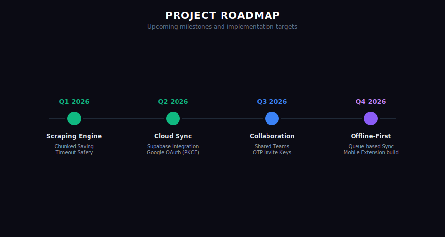

# Capsule Infinity



<div align="center">
  <h3>Enhance Your Browser. Extend Your World.</h3>
  <p>Capture full, complex AI chat conversations as portable, reusable context units (Capsules) and sync them across devices via Supabase Cloud.</p>

  [](LICENSE)
  [](manifest.json)
  [](CONTRIBUTING.md)
</div>

---

## 🌟 Introduction

### What is Capsule Infinity?
Capsule Infinity is a browser extension that captures conversations across multiple generative AI platform pages (ChatGPT, Claude, Gemini, DeepSeek), formats them with custom systemic prompt contexts, and serializes them into portable context structures called **Capsules**. 

### Why was it built?
Brainstorming or debugging code across different model engines (e.g. migrating a debugging thread from Claude to ChatGPT) forces you to start from scratch. You lose history, debugging steps, and custom specifications. Capsule Infinity allows you to bridge this context gap.

### The Problem it Solves
* **Context Fragmentation**: Model sessions are isolated.
* **Scraping Connection Dropouts**: Browsers drop extension message channels when text data exceeds 1MB.
* **Transient Browser Caches**: Local caches are unstable and cannot sync across devices.

---

## 🛠 Features Matrix



* **Asynchronous Chunking Pipeline**: Splits large payloads into 50KB segments to safely navigate browser messaging thresholds.
* **Lazy-Load Scraping Engine**: Safely queries DOM structures, gracefully handling dynamic list changes.
* **Supabase Cloud Sync**: Instantiates Supabase connection over authenticated PKCE Google OAuth sessions.
* **Local Fallback Cache**: Zero service interruption by writing to `chrome.storage.local` if network drops.
* **Branded Watermark Footers**: Muted copyright footer branding placed inside popup and sidebar views.

---

## ⚡ How It Works



1. **Capture**: Injected content scripts scrape the conversation DOM tree.
2. **Prepend & Chunk**: Adds custom systemic prompts and splits payload into 50KB chunks.
3. **Assemble**: Background service worker registers chunks and compiles them.
4. **Cache & Replicate**: Pushes serialized capsule records to the cloud database (with local fallback).

---

## 📸 Interface Guide

### Quick Actions Popup



* **Stats Cards**: Instantly displays saved count metrics.
* **Quick Actions**: Triggers injected overlays on the active tab page.
* **Recent List**: Displays the last 6 saved capsules ready to copy.

### 📸 Extension Screenshots Gallery

Here are screenshots of Capsule Infinity in action showing its beautiful light and dark modes, context capture overlays, and advanced options:

<div align="center">
  <table border="0">
    <tr>
      <td></td>
      <td></td>
    </tr>
    <tr>
      <td></td>
      <td></td>
    </tr>
    <tr>
      <td></td>
      <td></td>
    </tr>
  </table>
</div>

---

## 📥 Installation Guide


### Option 1 (Recommended): Download ZIP

1. Open this [GitHub Repository](https://github.com/ahmadiscoding/capsule-infinity-chrome-extension) in your browser.
2. Click the **Code** button in the top right.
3. Select **Download ZIP** from the dropdown menu.
4. Extract the downloaded ZIP file to any folder on your computer.
   * *Note: Make sure to extract the files! Chrome cannot load extensions directly from inside a compressed ZIP file.*

### Option 2: Clone with Git

If you prefer using the command line, run this clone command in your terminal:

```bash
git clone https://github.com/ahmadiscoding/capsule-infinity-chrome-extension.git
```

---

### Load the Extension into Chrome or Brave

1. Open your Google Chrome or Brave browser.
2. Navigate to the extensions page by typing the following in the URL bar and pressing Enter:
   * **Chrome**: `chrome://extensions/`
   * **Brave**: `brave://extensions/`
3. Turn **Developer mode** **ON** using the toggle switch in the top-right corner.
   > 💡 **Developer Mode**: This allows your browser to run local extension files that aren't downloaded from the official Chrome Web Store.
4. Click the **Load unpacked** button in the top-left corner.
5. In the window that pops up, navigate to your extracted project folder and select the **`source`** folder (which contains the `manifest.json` file).
6. Click **Select Folder**.

### ✅ You're Done! 🎉

The **Capsule Infinity** extension is now active! You should see its icon in your browser toolbar.

**If the icon does not appear on your toolbar:**
1. Click the **Extensions (🧩)** puzzle icon in the top-right corner of your browser.
2. Find **Capsule Infinity** in the list.
3. Click the **Pin (📌)** icon next to it to lock it to your toolbar for quick access.

---

## 📂 Project Architecture



* `manifest.json`: Configuration declarations.
* `background.js`: Main MV3 background service worker, coordinates OAuth, and handles sync pools.
* `/content-scripts/generic.js`: Scrapes DOM blocks and pushes chunked payloads.
* `/lib/storage.js`: Offline-first database API client (Supabase + Local fallback).
* `/lib/supabase-js.js`: Minified Supabase Client JS SDK.
* `/popup/` & `/sidebar/`: Panel view layouts and UI handlers.

---

## 🗺 Roadmap



* **Milestone 1: Core Performance (Completed)**: Scraper engine, chunked save queue, timeout guards.
* **Milestone 2: Cloud Sync (Completed)**: Supabase sync integration, Google Account PKCE auth, local cache fallback.
* **Milestone 3: Workspace Collaboration (Planned / Upcoming)**: Multi-user organization team workspaces list, automated Supabase team schema migrations, and secure OTP/Invite key credentials exchange framework for cross-organization synchronization.
* **Milestone 4: Mobile Expansion (Planned / Future)**: Dedicated iOS and Android mobile apps alongside mobile browser extensions support to seamlessly carry capsules and prompt context across desktop and mobile devices.
* **Milestone 5: LLM Ecosystem & Chatbot Expansion**: Native support for the "Big 4" generative AI interfaces (ChatGPT, Claude, Gemini, and DeepSeek) with plans to expand scraper inject engines to additional enterprise chatbot platforms and open-source model interfaces (e.g., Hugging Face, OpenWebUI, LibreChat).

---

## ❓ FAQ

#### Why does it show "Authorization page could not be loaded"?
As the extension owner, ensure that your users' Chrome Extension redirect URL (e.g. `https://<extension-id>.chromiumapp.org/`) is whitelisted in your Supabase project dashboard under **Authentication > URL Configuration**.

#### Does it support Brave Browser?
Yes! If Brave blocks the login popup, click the Brave Shield icon and set cookies to "Allow all cookies" or turn off shields for the auth page temporarily.

---

## 🤝 Contributing

We welcome code contributions! See our **[Contributing Guidelines](CONTRIBUTING.md)** and **[Code of Conduct](CODE_OF_CONDUCT.md)** to get started.

---

## 📄 License

This project is licensed under the MIT License - see the **[LICENSE](LICENSE)** file for details.
