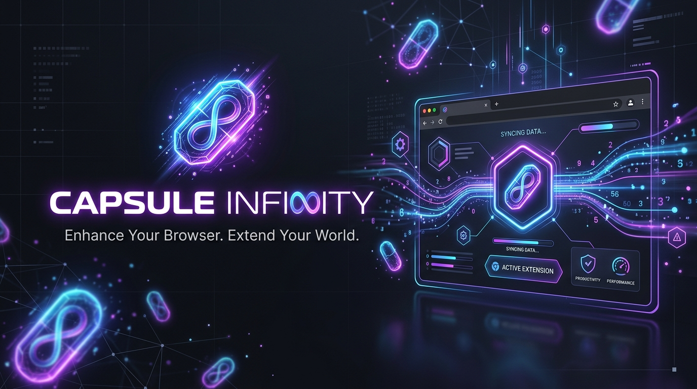
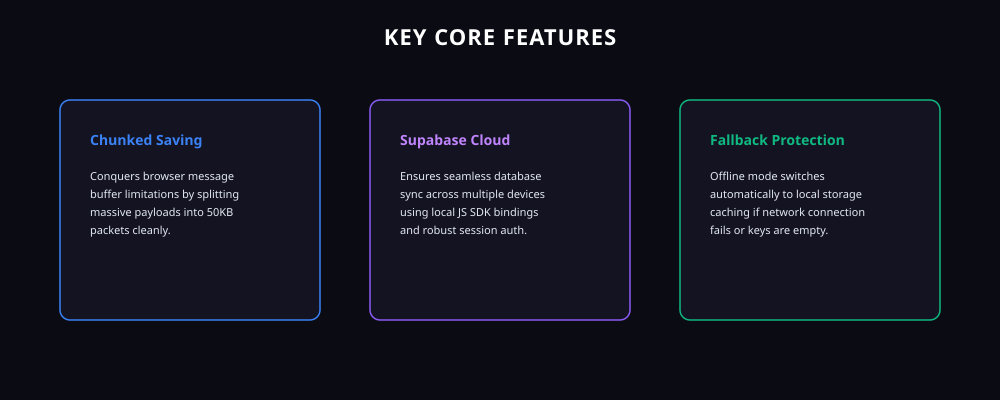
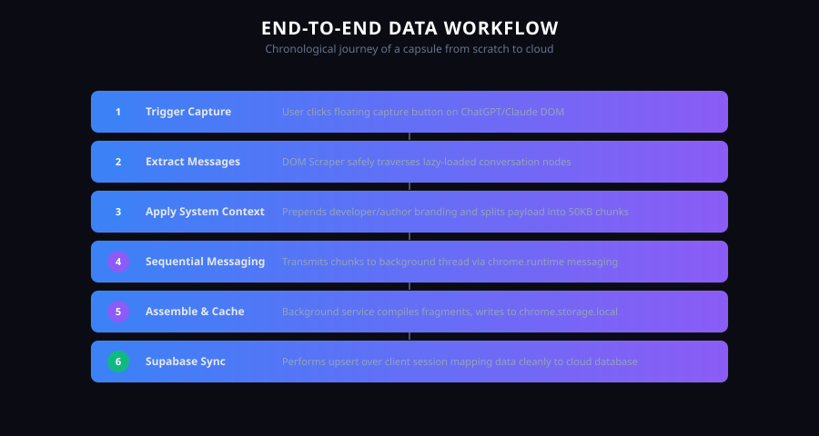
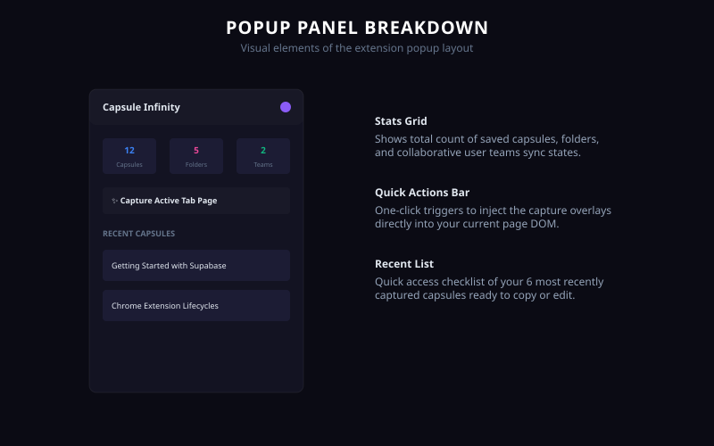
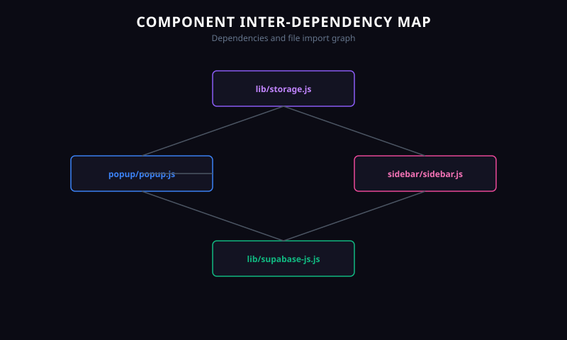

# Capsule Infinity



<div align="center">
  <h3>Enhance Your Browser. Extend Your World.</h3>
  <p>Capture full, complex AI chat conversations as portable, reusable context units (Capsules) and sync them across devices via Supabase Cloud.</p>

  [](LICENSE)
  [](manifest.json)
  [](CONTRIBUTING.md)
</div>

---

## 🌟 Introduction

### What is Capsule Infinity?
Capsule Infinity is a Chrome MV3 extension that captures conversations across multiple generative AI platform pages (ChatGPT, Claude, Gemini, DeepSeek), formats them with custom systemic prompt contexts, and serializes them into portable, hyper-compact context structures called **Capsules**.

### Why was it built?
Brainstorming or debugging code across different model engines (e.g. migrating a debugging thread from Claude to ChatGPT) forces you to start from scratch. You lose history, debugging steps, and custom specifications. Capsule Infinity bridges this context gap with zero friction.

### The Problem it Solves
* **Context Fragmentation**: Model sessions are isolated.
* **Token Bloat**: Raw chat transcripts contain massive amounts of conversational filler that consume context windows.
* **Scraping Connection Dropouts**: Browsers drop extension message channels when text data exceeds thresholds.
* **Transient Browser Caches**: Local caches are unstable and cannot sync across devices.

---

## 🛠 Features Matrix



* **AI Compression Backend (Supabase Edge Function)**: Server-side LLM engine supporting Gemini Flash & Groq (`llama-3.3-70b-versatile`) smart routing with 10s timeout failovers, without exposing provider API keys to client extensions.
* **Narrative Capsule Format**: Structured output with clear sections: `User Intent`, `Key decisions made`, `Constraints or requirements identified`, and `Technicalities/Details` saving 80–90% of tokens while preserving 100% of technical fidelity.
* **Smart Deduplication Caching (Part 19)**: Lightweight conversation fingerprinting prevents redundant Edge Function calls and quota consumption when capturing unchanged chats.
* **Atomic Usage & Capacity Metering**: Per-user monthly quota checks (`check_and_increment_usage`) and global daily capacity soft-caps (`increment_provider_daily`) enforced via PostgreSQL `SECURITY DEFINER` RPC functions.
* **Contextual Floating Banners**: Signal-driven, animated injected banners prioritizing page rate-limit detection, long conversation warnings, saved context quick-pickers, and logged-out nudges.
* **Gmail Web Compose Everywhere**: Direct web composer integration (`CapsuleUtils.openGmailCompose`) for Pro access requests and support inquiries, eliminating broken desktop `mailto:` clients.
* **Persistent Feedback & Conditional Check-in**: Integrated 1–5 star rating system with a dedicated follow-up check-in for low ratings and always-accessible support entry points.
* **Supabase Cloud Sync & Local Fallback**: Seamless cloud replication via authenticated PKCE Google OAuth sessions, with zero service interruption local fallback to `chrome.storage.local`.

---

## ⚡ How It Works



1. **Capture**: Injected content scripts scrape the conversation DOM tree.
2. **Deduplication Cache Check**: Evaluates conversation fingerprint (`platform::url::messageCount::snippet`). If unchanged, reloads cached capsule instantly with zero quota usage.
3. **AI Compression Edge Function**: Transcripts are sent with session tokens to `/functions/v1/compress`. The Edge Function verifies user quota, checks daily capacity, smart-routes (Gemini for technical/large transcripts, Groq for short chats), and returns structured narrative JSON.
4. **Assemble & Chunk**: Client renders the human-readable `**ACTIVE CAPSULE CONTEXT**` format and chunks data into 50KB segments for storage.
5. **Cache & Replicate**: Pushes serialized capsule records to the cloud database (with local fallback).

---

## 🛠 Backend & Edge Function Setup

### 1. Database Schema
Run the full SQL schema in `database/supabase_schema.sql` inside your Supabase SQL Editor. This sets up the `capsules`, `user_usage`, `provider_daily_usage`, and `user_feedback` tables along with atomic PL/pgSQL functions:
- `check_and_increment_usage(target_user_id UUID, max_limit INT)`
- `increment_provider_daily(p_provider TEXT, p_date DATE)`

### 2. Supabase Edge Function Deployment
Deploy the `compress` Edge Function to your Supabase project:
```bash
# Set provider API key secrets in Supabase
supabase secrets set GEMINI_API_KEY="your-gemini-key" GROQ_API_KEY="your-groq-key" GROQ_MODEL="llama-3.3-70b-versatile"

# Deploy Edge Function
supabase functions deploy compress
```

---

## 📸 Interface Guide

### Quick Actions Popup



* **Stats Cards**: Instantly displays saved count metrics.
* **Quick Actions**: Triggers injected overlays on the active tab page.
* **Recent List**: Displays the last 6 saved capsules ready to copy.
* **Circular Support Button**: Floating 💬 action opening direct Gmail compose.

---

## 🚀 Quick Setup Guide

### Step 1: Get the Files
* **Option A (Easiest):** Click the Blue **Code** button at the top right ➔ **Download ZIP**, then **Extract/Unzip** the folder on your computer.
* **Option B (Developers):** Run this command in your terminal:
  ```bash
  git clone https://github.com/ahmadiscoding/capsule-infinity-chrome-extension.git
  ```

### Step 2: Load into Chrome / Brave
1. Open a new tab and go to `chrome://extensions/` (or `brave://extensions/`).
2. Turn **ON** Developer mode using the toggle switch in the top-right corner.
3. Click the **Load unpacked** button in the top-left corner.
4. Select the **`source`** folder inside your project directory.

🎉 **You're Done!** Pin the Capsule Infinity icon to your toolbar for quick access.

---

## 📂 Project Architecture



* `manifest.json`: Configuration declarations (MV3).
* `background.js`: Main background service worker, coordinates OAuth, token refresh, and Edge Function requests.
* `/supabase/functions/compress/`: Deno TypeScript Supabase Edge Function for server-side transcript compression.
* `/database/supabase_schema.sql`: Full SQL schema, RLS policies, and atomic RPC functions.
* `/content-scripts/generic.js`: Content script handling DOM scraping, contextual banners, limit modals, and user feedback.
* `/lib/storage.js`: Offline-first database API client (Supabase + Local fallback).
* `/lib/supabase-client.js`: Shared Supabase initialization & MV3 session management client.
* `/lib/utils.js`: Shared formatting and Gmail Web Compose helpers.
* `/popup/` & `/sidebar/`: Panel view layouts and UI handlers.

---

## ❓ FAQ & Support

#### How to request Pro Access or contact support?
For questions, support, or Pro plan activation ($2), contact us at: **`capsuleinfinity.support@gmail.com`**.

#### Why does it show "Authorization page could not be loaded"?
Ensure that your users' Chrome Extension redirect URL (e.g. `https://<extension-id>.chromiumapp.org/`) is whitelisted in your Supabase project dashboard under **Authentication > URL Configuration**.

#### Does it support Brave Browser?
Yes! If Brave blocks the login popup, click the Brave Shield icon and set cookies to "Allow all cookies" or turn off shields for the auth page temporarily.

---

## 🤝 Contributing

We welcome code contributions! See our **[Contributing Guidelines](CONTRIBUTING.md)** and **[Code of Conduct](CODE_OF_CONDUCT.md)** to get started.

---

## 📄 License

This project is licensed under the MIT License - see the **[LICENSE](LICENSE)** file for details.

