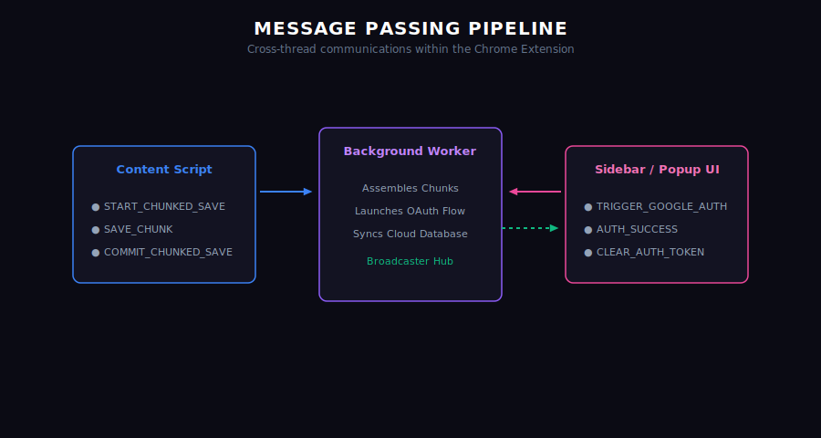

# Message Passing API Reference

Capsule Infinity utilizes an asynchronous, event-driven message-passing pipeline between the content scripts, background worker, and library UI pages.

## Message Actions

### 1. `START_CHUNKED_SAVE`
Sent by the content script to indicate a large payload is coming.
* **Arguments**:
  * `transferId` (string): Unique identifier for the transfer.
  * `totalChunks` (number): Count of expected packet segments.
  * `metadata` (object): Title, platform, sourceUrl, tags, folderId.

### 2. `SAVE_CHUNK`
Sent by the content script to transmit individual segments.
* **Arguments**:
  * `transferId` (string): Key matching the transaction.
  * `chunkIndex` (number): 0-indexed segment tracker.
  * `chunkData` (string): 50KB string fragment.

### 3. `COMMIT_CHUNKED_SAVE`
Sent by the content script to assemble chunks, generate the UUID, write local records, and upsert to Supabase.
* **Arguments**:
  * `transferId` (string): Key matching the transaction.

### 4. `TRIGGER_GOOGLE_AUTH`
Sent by the UI panels to request Google OAuth login in the background.