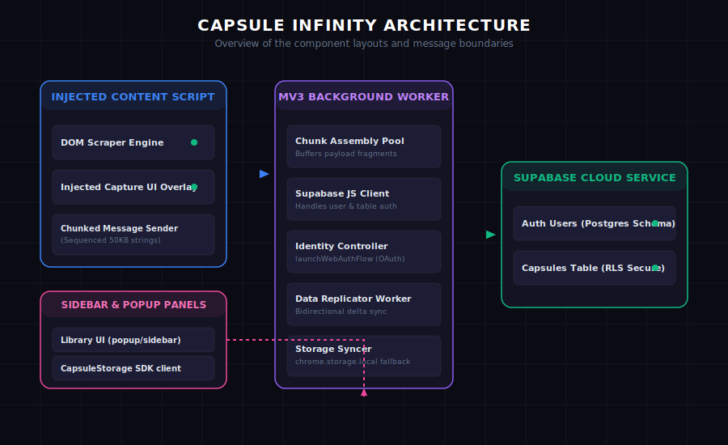

# System Architecture

Capsule Infinity is built on the Manifest V3 Google Chrome extension architecture.

## System Components

### 1. Injected Content Script (`content-scripts/generic.js`)
* Executes in the context of the active AI tab.
* Detects container nodes, scrapes message blocks, and applies systemic prompts.
* Implements the chunking buffer loops to stream payloads to the worker thread.

### 2. Background Service Worker (`background.js`)
* Operates in an isolated background script thread.
* Acts as the main communication router and session state holder.
* Authenticates users via `chrome.identity.launchWebAuthFlow` and initializes the local Supabase SDK client.

### 3. Database Layer (`lib/storage.js`)
* Instantiates the Supabase client and provides database read/write abstractions.
* Handles transactional queries and converts text keys into Postgres UUID indexes.
* Coordinates local backup routines via `chrome.storage.local`.

### 4. Sidebar Panel (`sidebar/`) & Popup (`popup/`)
* Displays library lists, stats grids, and folder structures.
* Communicates with background threads to sync views instantly on authentication change events.