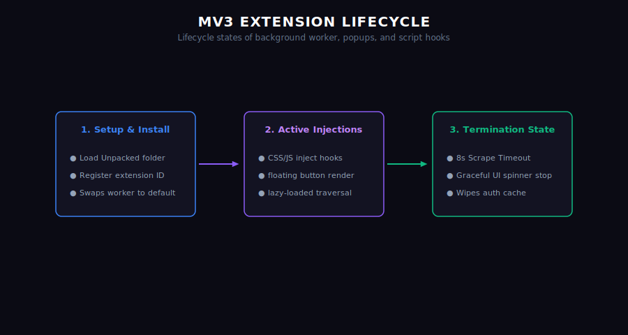

# Background Service Worker

The Background script (`background.js`) acts as the central coordinator of Capsule Infinity. It runs in an isolated service worker context.

## Core Tasks

### 1. Chunked Payload Assembly
Buffers incoming string fragments in memory until all chunks have arrived, then merges and serializes them into a single clean capsule document.

### 2. OAuth Authentication Hub
Manages Google Google Account WebAuthFlow redirects, parses PKCE authorization codes, exchanges them for access tokens, and securely sets active Supabase database client sessions.

### 3. Sync Scheduler
Runs sync loops in the background to propagate updates between your offline storage cache and the Supabase database server.