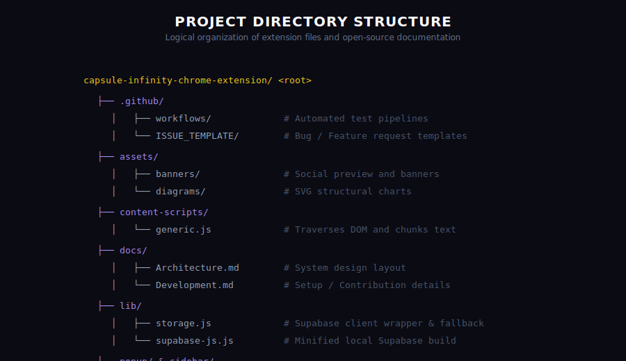

# Folder Structure

Here is a breakdown of the Capsule Infinity files and folder layout.

## Directory Layout
* `manifest.json`: Configuration manifest file containing permissions, background scripts, content injections, and extension IDs.
* `background.js`: Main MV3 background service worker. Handles message parsing, authentication transitions, and cloud sync loops.
* `supabase_schema.sql`: Postgres SQL queries to prepare database tables and policies.
* `/content-scripts/`:
  * `generic.js`: DOM parsing script injected into Gemini, Claude, and ChatGPT pages.
* `/lib/`:
  * `storage.js`: CRUD interfaces for Chrome storage and Supabase database clients.
  * `supabase-js.js`: Local minified build of the official Supabase Client JS SDK.
  * `utils.js`: Text string counts, formatting tools, and systemic prompt configurations.
  * `api.js`: Legacy client configurations.
* `/popup/`:
  * `popup.html` & `popup.js`: Layout for the browser toolbar popup window.
* `/sidebar/`:
  * `sidebar.html` & `sidebar.js`: Layout for the side panel dashboard library.