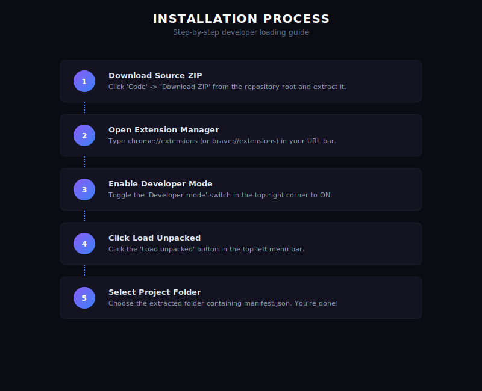

# Installation Guide

Capsule Infinity is loaded as an unpacked browser extension. Follow these simple steps to install it on Google Chrome or Brave Browser.



## Step-by-Step Instructions

### Step 1: Download the Source Code
1. Clone this repository to your local machine:
   ```bash
   git clone https://github.com/your-username/capsule-infinity.git
   ```
2. Alternatively, click the green **Code** button and select **Download ZIP**, then extract the contents to a folder.

### Step 2: Open Extensions Settings
1. Open your browser.
2. Navigate to:
   * **Chrome**: `chrome://extensions/`
   * **Brave**: `brave://extensions/`

### Step 3: Enable Developer Mode
1. In the top-right corner of the Extensions page, toggle the **Developer mode** switch to **ON**.

### Step 4: Load the Extension
1. Click the **Load unpacked** button in the top-left corner.
2. Select the repository root folder (the folder containing `manifest.json`).

### Step 5: Pin the Extension
1. Click the puzzle icon in your browser toolbar.
2. Click the pin icon next to **Capsule Infinity** to pin it for easy access.