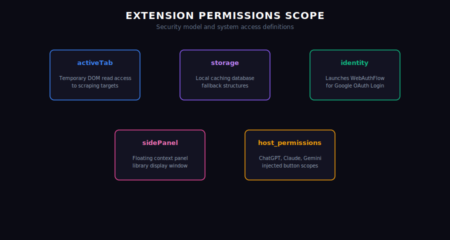

# Permissions Model

Capsule Infinity enforces strict, granular permissions inside `manifest.json` to preserve user privacy and secure browsing sessions.

## Declared Permissions

### 1. `activeTab`
* **Purpose**: Grants temporary host access to read the DOM structure when the user explicitly clicks the Capture button.
* **Privacy Impact**: Minimal. The extension cannot monitor background pages or track pages where you haven't triggered capture.

### 2. `storage`
* **Purpose**: Permits access to `chrome.storage.local` to store your local backup cache, user profiles, and active database configuration keys.

### 3. `identity`
* **Purpose**: Grants access to `chrome.identity.launchWebAuthFlow` to initiate the secure login popup window and fetch Google token sessions.

### 4. `sidePanel`
* **Purpose**: Allows the browser library to open as a dockable sidebar panel on the right side of the screen.