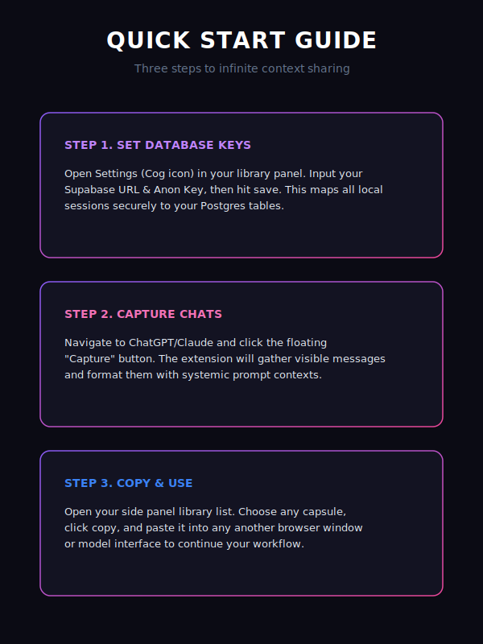

# Quick Start Guide

Connect Capsule Infinity to your Supabase Cloud database to enable cross-device synchronization.



## 1. Create a Supabase Database
1. Go to [supabase.com](https://supabase.com) and sign in.
2. Click **New Project** and name it (e.g. `Capsule Infinity`).
3. Set your pricing tier to **Free** and wait 2 minutes for provisioning.

## 2. Initialize the Database Schema
1. Click **SQL Editor** in the Supabase left sidebar.
2. Click **New query**.
3. Copy the SQL script in `supabase_schema.sql` at the root of the repository, paste it into the editor, and click **Run**.

## 3. Configure the Extension Connection
1. Open the Capsule Infinity sidebar panel in your browser (click the extension icon).
2. Go to **Settings** (cog tab).
3. Copy the **Project URL** and **anon public API key** from your Supabase Dashboard **Project Settings > API** page.
4. Paste them into the **Supabase URL** and **Supabase Anon Key** input fields and click **Save**.

## 4. Enable Google Sign-In
1. Navigate to **Authentication > Providers > Google** in your Supabase dashboard and toggle it to **ON**.
2. Input your **Google Client ID** and **Secret** from the Google Cloud Console.
3. Whitelist the extension redirect URL:
   ```text
   https://npemejbaipjliofhdjbhblefjjpghjhg.chromiumapp.org/
   ```
   Add it under **Authentication > URL Configuration > Redirect URLs** in your Supabase dashboard.
4. Click **Sign In with Google** inside the extension and start syncing!