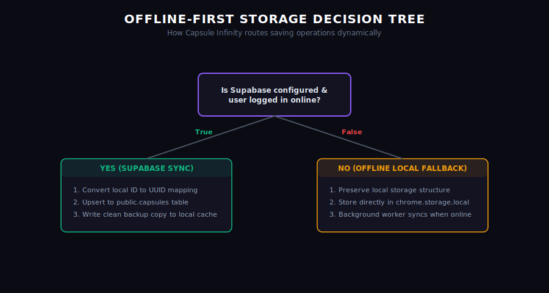

# Storage Layer Flow

Capsule Infinity implements a robust, offline-first data manager inside `source/lib/storage.js`.

## Data Operations & Performance Optimizations

### 1. `saveCapsule()`
* **Validation & Context Safety**: Instantly checks if `chrome?.runtime?.id` and `chrome?.storage?.local` are valid before accessing API modules. If the extension was reloaded in the background, it throws an error preventing UI crashes.
* **Cached Session Retrieval**: Utilizes the extremely fast, locally cached `sb.auth.getSession()` context instead of calling `sb.auth.getUser()`, eliminating any network-trip round latency during user checks.
* **Row-Level Select Integration**: Appends the `.select()` modifier to the capsule `upsert` query. Supabase returns the fully populated new row object upon database success.
* **Instant UI Refresh**: Inserts the returned row object directly into the local cache arrays and dispatches a `REFRESH_CAPSULES_UI` runtime sync broadcast.
* **Offline Backup**: Simultaneously updates the offline backup in `chrome.storage.local` to enable instant access.

### 2. `getAllCapsules()`
* **Cached session querying**: Retrieves user session context using `sb.auth.getSession()` for zero-delay startup retrieval.
* **Secure Client-Side Filtering**: Disables Row Level Security (RLS) bottlenecks and performs explicit query-level filtering (`.eq('user_id', userId)`) to ensure user profile isolation.
* **Offline Cache Fallback**: If the network connection fails (throwing a `Failed to fetch` error) or the user is offline, it gracefully falls back to local data cache.